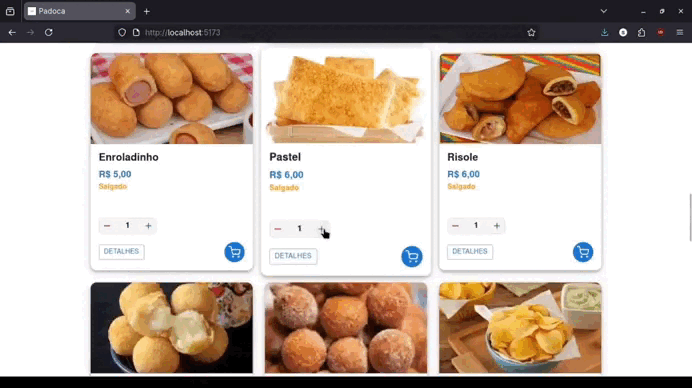

# 🥖 Padoca

  
  
  

  

## 🥐 Sobre o projeto

Pequenas padarias e lojas de salgados geralmente dependem apenas do WhatsApp para divulgar produtos e receber pedidos, o que acaba gerando mensagens desorganizadas, dificuldade de controle e falta de uma vitrine digital clara.

O **Padoca** nasce como uma solução simples para esse cenário:  
uma vitrine online onde o cliente visualiza os produtos e monta um pré-pedido de forma estruturada, enviando tudo diretamente para a loja via WhatsApp.

---

## 🎯 Objetivo

- Oferecer uma vitrine digital simples e objetiva  
- Facilitar a criação de pré-pedidos  
- Organizar as informações enviadas à loja  
- Atender pequenos negócios sem complexidade desnecessária  

---

## 📦 Escopo do MVP

Funcionalidades previstas para a primeira versão:

- Vitrine de produtos
- Organização por categorias
- Montagem de pedido com quantidades
- Envio do pedido via WhatsApp
- Registro básico de pedidos para a loja

---

## 🧱 Stack 

- **Frontend:** React  
- **Backend:** Ruby on Rails (API)  

---

## 📌 Observação

Este projeto tem caráter educacional e de portfólio, simulando um produto real voltado para pequenos negócios.
